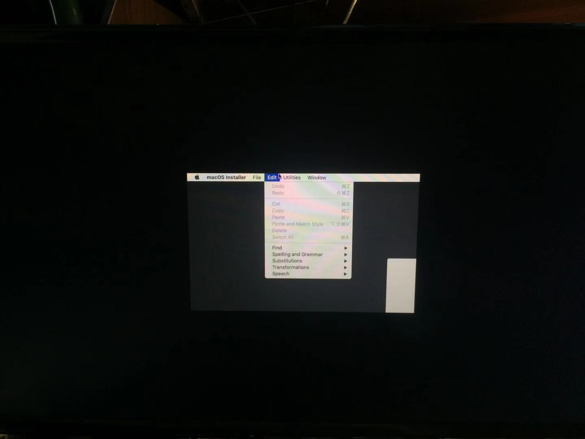
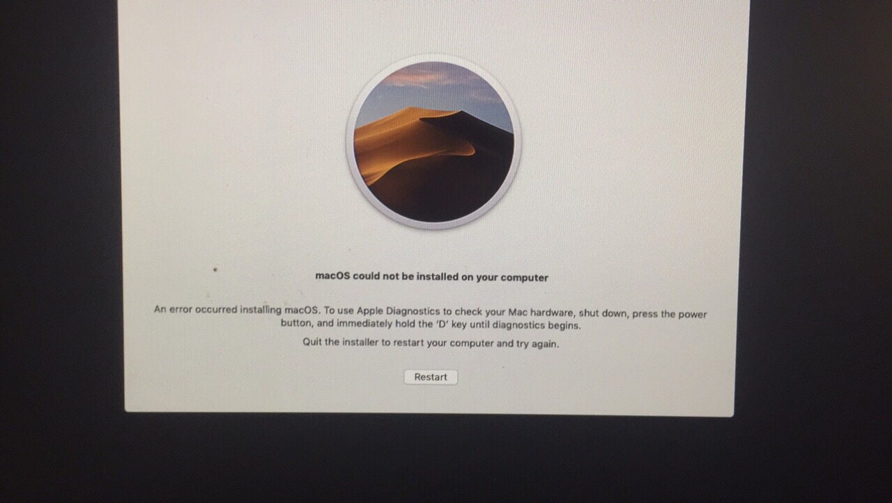
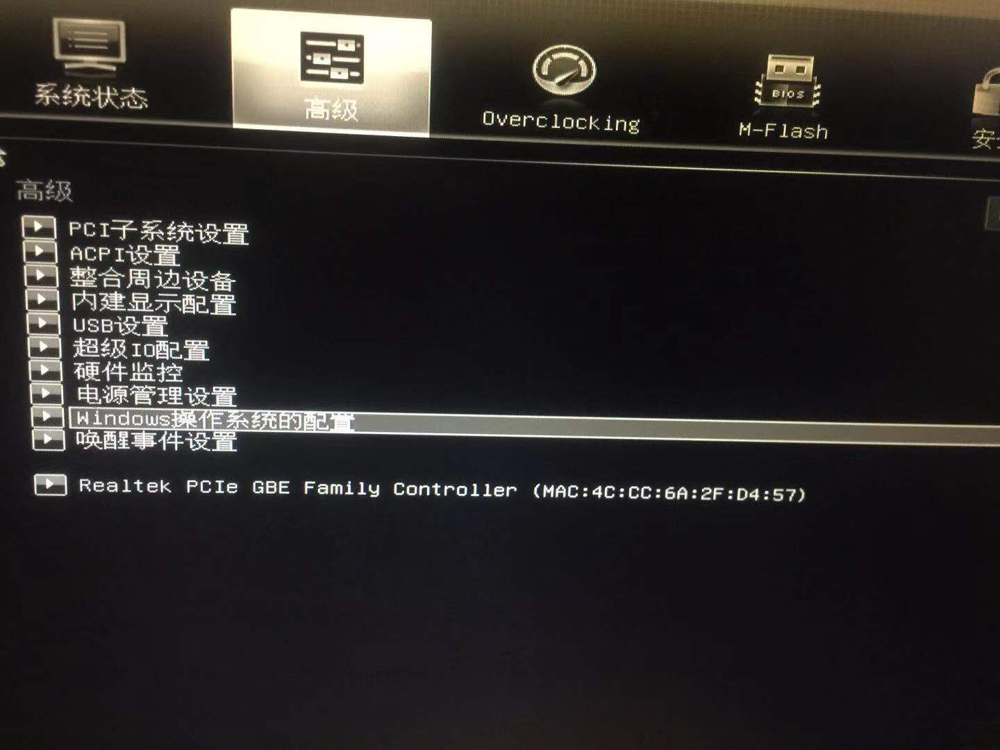
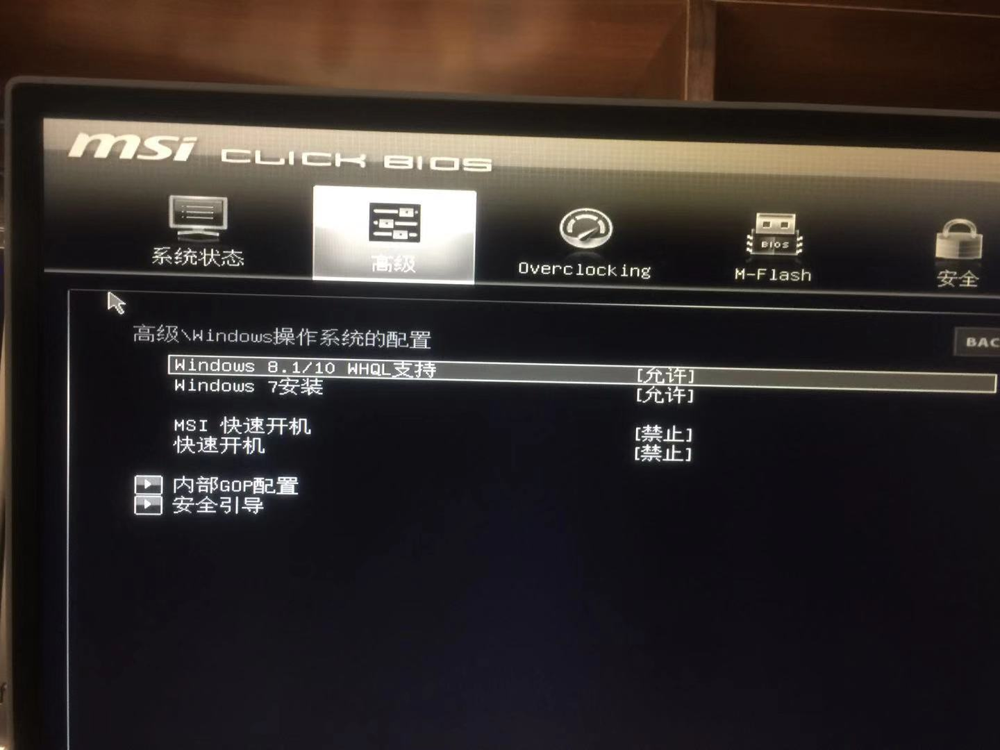
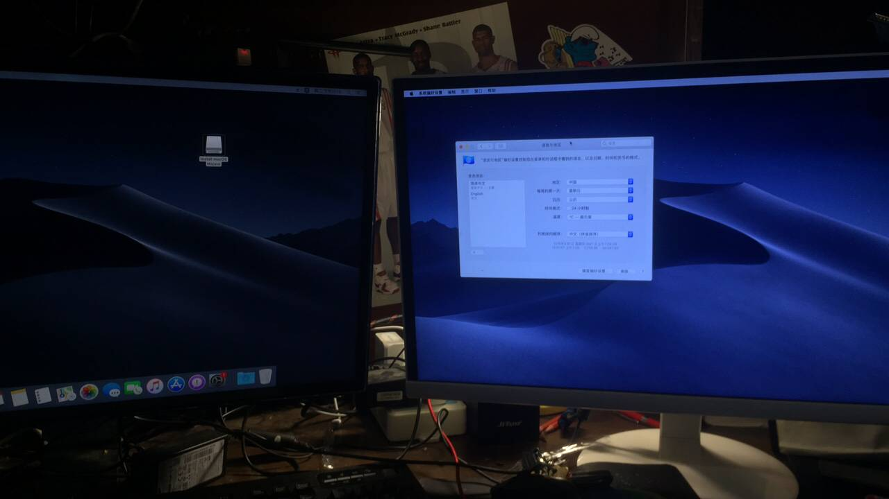
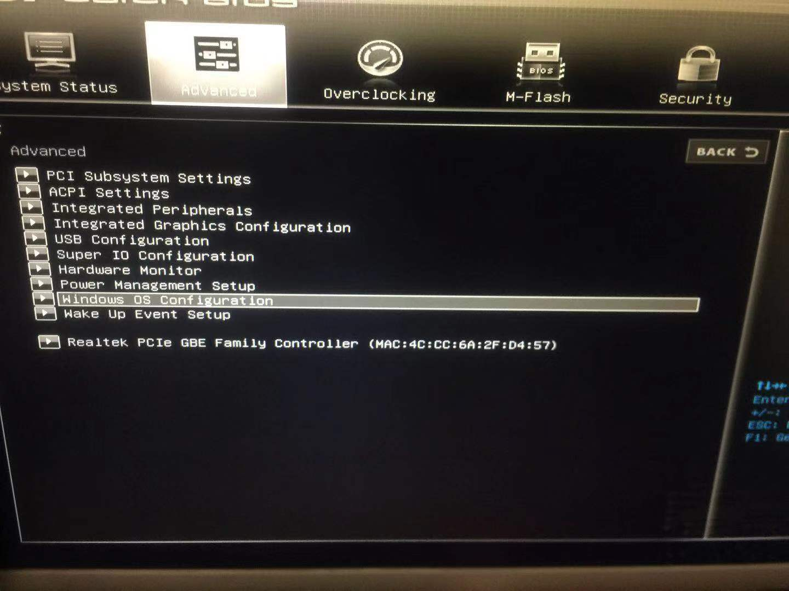
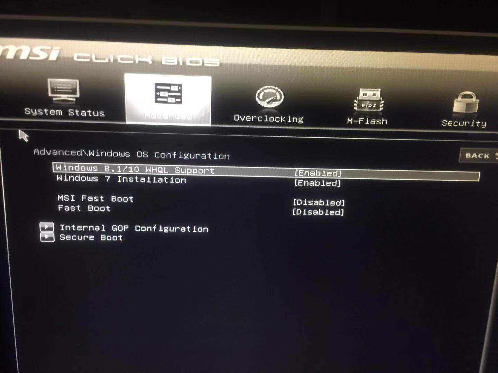

# chinese version guide
## 关于黑苹果安装10.14 屏幕只显示部分区域过小问题的解决方法
### 本人机器配置
<pre>
<b>处理器</b> 英特尔 Core i7-6700 @ 3.40GHz 四核`
<b>主板</b> 微星 B150M PRO-VD (MS-7996) ( 英特尔 Skylake-S - 100 Series/C230 Series 芯片组 Family - A148 )
<b>内存</b> 16 GB ( 三星 DDR4 2133MHz / 金邦 DDR4 2133MHz )
<b>主硬盘</b> 七彩虹 SL300 240GB ( 240 GB / 固态硬盘 )
<b>显卡</b> AMD Radeon RX Vega 64 ( 8 GB / AMD )
<b>显示器</b>	IPS2480 ( 24 英寸  )
<b>光驱</b>	DiscSoft Virtual 蓝光光驱
<b>声卡</b>	瑞昱 ALC887 @ 英特尔 High Definition Audio 控制器
<b>网卡</b>	瑞昱 RTL8168/8111/8112 Gigabit Ethernet Controller / 微星
</pre>
### 遇到的问题
1.一开始尝试使用ddmac对分区进行刷写，无奈总是失败，后来参考了网上的各种办法都解决不了，最后干脆重启即可。

2.无论使用懒人镜像还是官方原版镜像，进入安装界面之后都会遇到如下图的问题

如图


这个问题导致我无法正确操作安装界面从而无法进行下一步。
### 解决方法1

无意中发现的，在此界面上不停按回车之后，选择左上角启动终端，执行以下命令

```
# shutdown -s now
```

之后电脑应该会进入休眠状态，按下电源开关，电脑就会启动，这时候分辨率恢复正常。可以继续安装。
但是我依然遇到了如下问题。

显示 An error occured installling macOs。经过大佬的提醒，建议我不要安装变色龙处理过的懒人版，而是直接安装官方原版镜像。之后就安装成功了，但仅仅只是安装成功而已。
### 解决方法2
在上述过程安装成功后，我尝试进入苹果系统，但是很遗憾，这次连一点区域都不显示了，直接黑屏。经过我努力的爬贴，最终找到了一个解决方法。
这是十分重要的一步，打开bios，选择windows 操作系统的配置
在里面勾选Windows 8.1/10 WHQL支持，之后重启。



重启之后，你会很惊讶的发现显示正常了。
### 安装结果
这是我安装好之后的结果，支持双屏。

我的clover配置：

https://github.com/fjh1997/hackintosh-clover

参考:
 [1]: clover显卡注入功能详解https://www.cnblogs.com/motoyang/p/5140594.html

# english version guide

## solution to the problem that Screen only shows partial area on hackintosh 10.14 Mojave.

### My machine configuration
<pre>
<b>Processor</b> Intel Core i7-6700 @ 3.40GHz quad core
<b>Motherboard</b> MSI B150M PRO-VD (MS-7996) (Intel Skylake-S - 100 Series/C230 Series Chipset Family - A148 )
<b>Memory</b> 16 GB (Samsung DDR4 2133MHz / Jinbang DDR4 2133MHz)
<b>Main hard drive</b>Colorful SL300 240GB (240 GB / SSD)
<b>Graphics Card</b> AMD Radeon RX Vega 64 ( 8 GB / AMD )
<b>Display</b> IPS2480 (24 inches)
<b>Optical Disc Drive</b> Virtual Disc Drive
<b>Sound Card</b>  Realtek ALC887 @ Intel High Definition Audio Controller
<b>Network card</b>  Realtek RTL8168/8111/8112 Gigabit Ethernet Controller / MSI
</pre>
### Problems encountered
1. At first, I tried to use ddmac to write the partition, but it always failed. After searched almostly all  methods on the Internet,I just restart computer and it worked!

2. Regardless of which image you use. a lazy installer image or an official original image, you will encounter the following problem when opening the installer.

As shown


This problem prevented me from proceeding to the next step.
### Solution 1

Inadvertently , I found that if you press Enter on keyboard,then move the cursor to the upper left corner and start the terminal, execute the following command.

```
# shutdown -s now
```

The computer should go to sleep. Next, press the power button, the computer would wake from sleep mode, this time the resolution back to normal. By this way ,you can continue to install.
But I still encounter the following problems.

it shows An error occured installling macOs. And a friend advised me not to install with chameleoned lazy image, but to directly install with the official image. I tried， and the installation is successful. but  it is *Just the beginning*.
## Solution 2
After the above  successful installation, I try to open the Mac OS, but unfortunately, this time there is not even a little area shows, but directly black screen. After I worked hard to find a way, I finally found a solution.
It is a very important step : open bios, select the configuration of the windows operating system


Check the Windows 8.1/10 WHQL support inside and restart.



After  restart, you'll be surprised to find it get a normal display.
## Installation Results
This is the result after I successfully installed Mac OS .And it supports dual screen.

My clover configuration:

Https://github.com/fjh1997/hackintosh-clover

reference:
 [1]: Detailed description of clover graphics injection function https://www.cnblogs.com/motoyang/p/5140594.html
